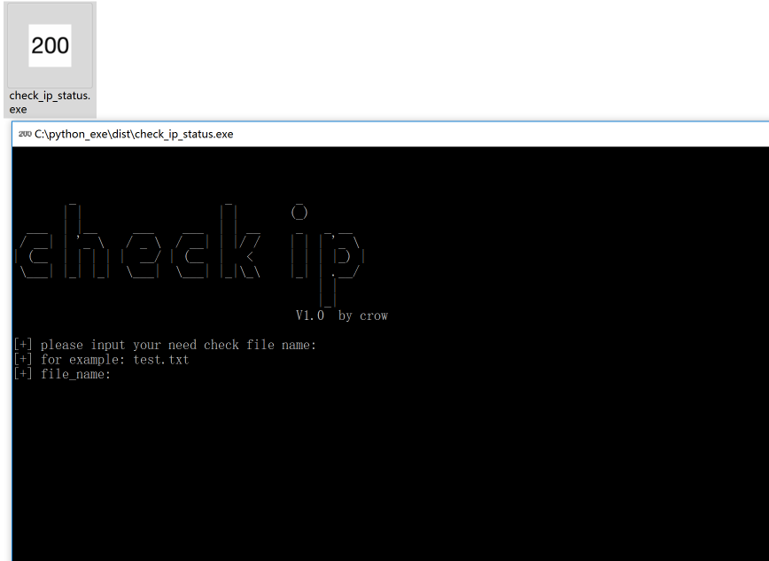
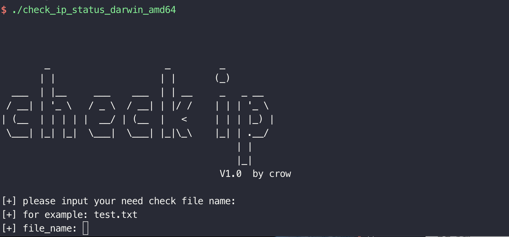

# mayfly_蜉蝣

### 寄蜉蝣于天地，渺沧海之一粟

**2021.03.11更新**

一款免费开源的信息搜集工具  mayfly

[点这里进行下载](https://github.com/crow821/mayfly/releases/tag/1.0)

**2021.03.22 更新**

一款免费开源的域名活性快速检测工具 checkIP

[点这里进行下载](https://github.com/crow821/mayfly/releases/tag/V1.0)

### 介绍

#### mayfly

- mayfly是由python3堆成的，使用pyinstaller在pipenv虚拟环境下打包
- 文件打包之后很大，这个也是python的缺点，每一个都有10多M，具体的md5值在下面
- 之所以没有放出源代码的主要原因是代码写的烂，师傅们自行逆向获取源码
- 代码打包之后，加载可能有些许的慢，属于正常现象

#### checkIP

- checkIP是由python3堆成的，使用pyinstaller在pipenv虚拟环境下打包
- 之所以没有放出源代码的主要原因是代码写的烂，师傅们自行逆向获取源码
- checkIP本来属于mayfly，但是在mayfly在爬取地址的时候，可能出现账号ip可获取ip受限制的情况，因此可以将已经获取的ip地址直接使用checkIP进行检测

### 功能

#### mayfly  V1.0 

- 实现fofa的ip信息获取，主要获取ip地址+端口，代码中其实已经加了其他的信息，但是我感觉目前第一版应当简洁，于是注释了其中的代码，fofa爬取的速度是5s进行一次，防止速度过快被ban
- 实现对fofa的ip爬取的地址进行活性检测，线程100，超过5s后无法建立有效连接，即认为此ip无效，因此可能存在一定的误报

#### checkIP  V1.0 

- 实现对fofa的ip爬取的地址进行活性检测，线程100，超过5s后无法建立有效连接，即认为此ip无效，因此可能存在一定的误报

### 版本信息

#### mayfly V1.0版本md5值：

| **mayfly_1.0_darwin_amd64.tar.gz** | aaa54ef1d899224a64a3551ff6300834     |
| ---------------------------------- | ------------------------------------ |
| **mayfly_1.0_linux_amd64.tar.gz**  | **fa816230af49c1749ba0ae4717b4e06e** |
| **mayfly_1.0_windows_amd64.zip**   | **6d522a17bc82009fe39fac4f57e70320** |

#### checkIP V1.0版本md5值：

| check_ip_status_darwin_amd64.tar.gz   | a429d8b2f41bf9271f0c1eac509ec51f     |
| ------------------------------------- | ------------------------------------ |
| check_ip_status_linux_amd64.tar.gz    | **a6a60a1ab051e9449dac14ca85c5f365** |
| **check_ip_status_windows_amd64.zip** | bd0b843e7b927d00ae425f38d4737f24     |

### mayfly V1.0使用方式

> 三个版本均需提供fofa的有效cookie，不然无法进行爬取，也就是说必须有fofa的会员
>
> 因为python3在32位下打包有些bug，所以三个版本目前仅支持在64系统下运行

##### fofa cookie截图

#### Windows

- 运行文件 mayfly_windows_amd64.exe

- 双击即可

##### Mac

- 运行文件 mayfly_darwin_amd64

- ./mayfly_darwin_amd64

##### Linux

- 运行文件 mayfly_linux_amd64

- 与mac下运行方式相同

### checkIP V1.0使用方式

> 三个版本只需提供ip文档即可
>
> 因为python3在32位下打包有些bug，所以三个版本目前仅支持在64系统下运行

#### Windows

- 运行文件 check_ip_status_windows_amd64.exe

- 双击即可

##### Mac

- 运行文件 check_ip_status_darwin_amd64

- ./check_ip_status_darwin_amd64

##### Linux

- 运行文件 check_ip_status_linux_amd64

- 与mac下运行方式相同

# Todo

- bug修复，版本迭代
- 分布式
- 。。。。。
- 下次一定不鸽

# 联系我

